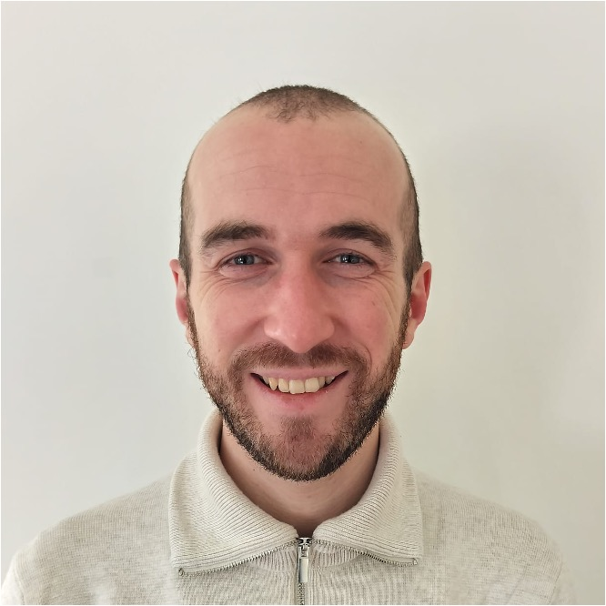

::: {.hero}
::: {.hero-text}

Postdoctoral Research Scientist · FWO / Universiteit Antwerpen

# Jérémy <em>Genette</em>

Phonetician working on the acoustics of speech production in typically
developing children and children with hearing impairment, on
methodological questions in speech science, and on Gallo-Romance
dialectology.

::: {.hero-tags}
Phonetics
Phonology
Child Language Acquisition
Laboratory Phonology
:::

::: {.hero-links}
[↓ Download CV](assets/cv.pdf){.btn .btn-primary target="_blank"}
[Publications](publications.qmd){.btn .btn-outline-secondary}
[Contact](contact.qmd){.btn .btn-outline-secondary}
:::

::: {.hero-links style="margin-top:.5rem;"}
[ResearchGate](https://www.researchgate.net/profile/Jeremy-Genette){.btn .btn-sm .btn-outline-secondary}
[Google Scholar](https://scholar.google.com/citations?user=4PhgZFcAAAAJ&hl=en){.btn .btn-sm .btn-outline-secondary}
[ORCID](https://orcid.org/0000-0002-1782-6656){.btn .btn-sm .btn-outline-secondary}
:::
:::

::: {.hero-photo-wrap}
{.hero-photo}
:::
:::

::: {.info-grid}
::: {.info-block}
### 🎓 Education
<ul class="info-list">
<li><strong>2021–2025</strong> · PhD in Linguistics — Universiteit Antwerpen, BE
Supervisors: Prof. Steven Gillis & Prof. Jo Verhoeven</li>
<li><strong>2019–2021</strong> · MA in Linguistics — Université Libre de Bruxelles, BE 
<em>summa cum laude</em></li>
<li><strong>2016–2019</strong> · BA in Modern Languages and Letters (English–Italian) — Université Libre de Bruxelles, BE 
Minor in Spanish · Erasmus at Università degli Studi Roma Tre, IT · <em>magna cum laude</em></li>
</ul>
:::

::: {.info-block}
### 💼 Academic positions
<ul class="info-list">
<li><strong>2025–2028</strong> · Postdoctoral research scientist — FWO / Universiteit Antwerpen, BE</li>
<li><strong>2025–2026</strong> · University lecturer — KU Leuven, BE</li>
<li><strong>2025–2026</strong> · University lecturer — Université de Mons, BE</li>
<li><strong>2021–2025</strong> · PhD fellow — Universiteit Antwerpen, BE</li>
<li><strong>Spring 2021</strong> · Research assistant — Université Libre de Bruxelles, BE (Autism in Context: phonetic transcription, PRAAT)</li>
<li><strong>2019–2021</strong> · Student-assistant — Université Libre de Bruxelles, BE</li>
</ul>
:::
:::
